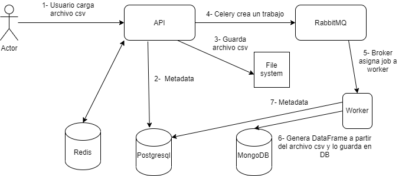
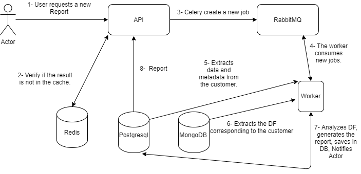

# DataCore.

# Content.

- [DataCore.](#datacore)
- [Content.](#content)
  - [Introduction.](#introduction)
  - [Technologies.](#technologies)
  - [Requirements.](#requirements)
  - [RunServer.](#runserver)
    - [Used ports.](#used-ports)
  - [Diagrams.](#diagrams)

## Introduction.

The main idea of this project is to develop a service that takes as input a .csv file, saves the metadata of the file in a relational database (Postgresql), and the data, inside the file, in a non-SQL database (MongoDB). Then the data in MongoDB will be used to create a dataset, which in the end will feed a machine learning model.

## Technologies.

- Docker, application container, all services are connected and work together thanks to the use of docker-compose.
- Django and Django Rest, a framework for API development, written in Python.
- Postgresql, to store user data and metadata in general.
- MongoDB, a non-relational database, will be responsible for storing the data frames that will be used to feed the machine learning model.
- Redis, an in-memory database engine, will be in charge of caching certain requests of our service.
- Celery, an asynchronous task distributor.
- Rabbitmq, as a message broker, works in conjunction with celery.
- Pandas, an excel on steroids.
- OpenApi, for service documentation.

## Requirements.

These are some fictitious requirements, used to implement several technologies I am interested in.

A retail company needs a service that can make a cluster of customers according to shopping habits and needs to visualize it through a dashboard, in order to build more effective marketing campaigns.

Taking into account the requirements of the business, the service should manage the registration of users and customers. Each customer can have more than one retail store. 

The client will upload the CSV file through a service that will extract the data, generate a data frame, and store; the extracted data in a database, and the CSV file in a file system.

The next step is to process these data frames through a machine learning model and from the results generate reports.

## RunServer.

In order to build the development environment, it is necessary to clone the repository and create a .env file in the root of the repository, this file must have the necessary configurations and credentials.


```
git clone url
```
.env
```
SECRET_KEY=1234567
ALGORITHM='HS256'
ACCESS_TOKEN_EXPIRE_DAYS=1
ENCODING=utf-8
POSTGRES_USER=core
POSTGRES_PASSWORD=
POSTGRES_DB=core
POSTGRES_HOST_AUTH_METHOD=trust
POSTGRES_HOST=db
POSTGRES_PORT=5432
DEBUG=True
ALLOWED_HOSTS=localhost, 127.0.0.1
REDIS_HOST=redis
REDIS_PORT=6379
REDIS_PASSWORD=
MONGO_INITDB_ROOT_USERNAME=core
MONGO_INITDB_ROOT_PASSWORD=
MONGO_INITDB_DATABASE=data
MONGO_PORT=21017
DJANGO_PORT=8000
ADMINER_PORT=8080
MONGO_HOST=mongodb
CELERY_DEBUG=1
CELERY_DJANGO_ALLOWED_HOSTS=localhost, 127.0.0.1, [::1]
RABBITMQ_PORTS_1=5672
RABBITMQ_PORTS_2=15672
RABBITMQ_DEFAULT_USER=core
RABBITMQ_DEFAULT_PASS=
RABBITMQ_DEFAULT_VHOST=/
RABBITMQ_DEFAULT_HOST=rabbitmq
```

The following command tells Docker to use the .env file to build without using the cache.

```
docker-compose --env-file .env up --build
```


### Used ports.

| SERVICE | PORT | 
|--|--|
| REST-API | 8000|
| ADMINER | 8080 |
| OPENAPI | 8181 |
|  MONGO-EXPRESS | 8443 |
| MONGO | 27017 |
| POSTGRES | 5432 |

## Diagrams.

In the following image, we can see the flow when the user loads a CSV file.



 1. The user loads the CSV file through the service.
     1. The service generates a hash for each file it receives and saves it as metadata, then compares if the hash already exists in the database, if so, it sends an error saying that the file has already been uploaded.
  2. It saves metadata of the file and the user.
  3. Saves the CSV file to a file system.
  4. Celery creates an asynchronous job and passes it to the broker.
  5. The worker checks if there are jobs in the broker.
  6. The worker generates a data frame from the data inside the CSV file, this data frame is stored in the mongo database, and more metadata is added to the Postgres database.

Below is a description of the flow when the user requests a report.



  1. The user requests a report.
  2. The API checks if the data is cached.
  3. A new job is created through celery and sent to the broker.
  4. The worker takes a new job.
  5. It verifies if the client's data exists in the PostgreSQL database, if so, it extracts its data and metadata.
  6. It obtains the data frames corresponding to that user.
  7. Analyze the data frames with a machine learning model for clustering. 
  8. Saves the information in PostgreSQL and notifies the user.
