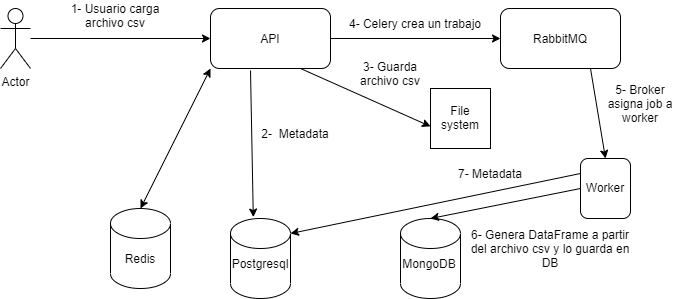
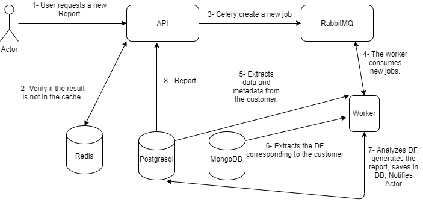

# DataCore

DataCore is a Django REST backend for ingesting CSV files, storing file and user metadata in PostgreSQL/PostGIS, persisting tabular data in MongoDB, caching application data in Redis, and processing asynchronous workloads through Celery and RabbitMQ.

## Contents

- [Project overview](#project-overview)
- [Architecture](#architecture)
- [Technology baseline](#technology-baseline)
- [Development setup](#development-setup)
- [Continuous integration](#continuous-integration)
- [Branch and release workflow](#branch-and-release-workflow)
- [Technical documentation](#technical-documentation)
- [Current roadmap](#current-roadmap)
- [Diagrams](#diagrams)

## Project overview

The project models a retail analytics service. A client uploads CSV data, the application records metadata in PostgreSQL/PostGIS, stores the extracted tabular data in MongoDB, and schedules asynchronous processing through Celery. Redis provides caching and is also used by the isolated CI integration check to record proof that a Celery worker executed a task.

The intended application flow includes:

1. user and customer management;
2. CSV upload and duplicate detection;
3. metadata persistence in PostgreSQL/PostGIS;
4. data-frame persistence in MongoDB;
5. asynchronous processing through Celery and RabbitMQ;
6. cached reads through Redis;
7. future clustering and reporting workflows.

## Architecture

```text
Django REST API
├── PostgreSQL 14 + PostGIS 3.2   metadata and relational data
├── MongoDB 8.0                   tabular and data-frame storage
├── Redis 7.4                     cache and CI execution markers
└── Celery 5.4
    └── RabbitMQ 4                asynchronous task broker
```

The CI workflows validate each infrastructure dependency independently, exercise the complete Celery publication and worker-execution path, and build the real application Docker image.

## Technology baseline

| Component | Current validated version or role |
| --- | --- |
| Python | 3.12 |
| Django | 5.2.16 LTS |
| Django REST Framework | 3.15.2 |
| PostgreSQL/PostGIS | PostgreSQL 14 with PostGIS 3.2 |
| MongoDB | 8.0 |
| Redis | 7.4 |
| RabbitMQ | 4.x |
| Celery | 5.4.0 |
| Application image | Python 3.12 on Debian Bookworm |
| Coverage gate | Minimum 70% total measured coverage |
| CI runner | Ubuntu 22.04 |

The complete pinned Python dependency set is maintained in [`requirements.txt`](requirements.txt).

## Development setup

### 1. Clone the repository

```bash
git clone https://github.com/chrismedinapy/backend.git
cd backend
```

### 2. Create a Python environment

```bash
python3.12 -m venv .venv
source .venv/bin/activate
python -m pip install --upgrade pip
python -m pip install -r requirements.txt
python -m pip check
```

### 3. Configure environment variables

Create a `.env` file in the repository root. The application settings expect values equivalent to the following:

```dotenv
SECRET_KEY=replace-me
DEBUG=True
ALLOWED_HOSTS=localhost,127.0.0.1

POSTGRES_DB=core
POSTGRES_USER=core
POSTGRES_PASSWORD=replace-me
POSTGRES_HOST=localhost
POSTGRES_PORT=5432

REDIS_HOST=localhost
REDIS_PORT=6379
REDIS_PASSWORD=

MONGO_INITDB_DATABASE=data
MONGO_HOST=localhost
MONGO_PORT=27017

RABBITMQ_DEFAULT_HOST=localhost
RABBITMQ_PORTS_1=5672
RABBITMQ_PORTS_2=15672
RABBITMQ_DEFAULT_USER=core
RABBITMQ_DEFAULT_PASS=replace-me
RABBITMQ_DEFAULT_VHOST=/

ALGORITHM=HS256
ACCESS_TOKEN_EXPIRE_DAYS=1
ENCODING=utf-8
DJANGO_PORT=8000
ADMINER_PORT=8080
CELERY_DEBUG=False
```

Do not commit real credentials.

### 4. Prepare and run Django

With PostgreSQL/PostGIS, Redis, MongoDB, and RabbitMQ available at the configured addresses:

```bash
python manage.py check
python manage.py migrate
python manage.py runserver
```

The isolated CI configuration can be exercised locally with:

```bash
DJANGO_SETTINGS_MODULE=core.settings_ci python manage.py check
```

### 5. Build and smoke-test the application image

```bash
docker build --tag datacore:local .
docker run --rm datacore:local python -m pip check
docker run --rm \
  --env DJANGO_SETTINGS_MODULE=core.settings_ci \
  datacore:local \
  python manage.py check
```

The automated image check confirms that the image builds, uses Python 3.12, loads the native GDAL integration, passes Django system checks, and does not contain `.git`, `.github`, or `.env`.

This does not yet validate the complete production deployment topology, registry publishing, image signing, vulnerability scanning, or a production WSGI/ASGI server.

## Continuous integration

Two GitHub Actions workflows protect pull requests targeting the permanent branches:

- `Django CI baseline` validates the application and service integrations;
- `Production Docker image` builds and smoke-tests the application container.

These workflows are complementary, not duplicates. A normal pull request into `release` or `main` is expected to display exactly two primary checks:

```text
Django system, migration, test and coverage checks
Build and smoke test production image
```

The Django workflow runs for pull requests and pushes targeting `release` and `main`. The image workflow runs for pull requests targeting `release` or `main`, pushes to `main`, and manual executions. It intentionally skips pushes to `release` to avoid rerunning the same image build immediately after a successful feature PR.

The application checks use the isolated settings module:

```text
DJANGO_SETTINGS_MODULE=core.settings_ci
```

### Current CI validation

The workflows currently validate:

- dependency installation and consistency through `pip check`;
- Django system checks;
- PostgreSQL/PostGIS connectivity;
- missing-migration detection;
- migration application and migration-plan generation;
- Redis connectivity and cache operations;
- MongoDB connectivity and CRUD operations;
- RabbitMQ authentication and AMQP connectivity through the real Celery configuration;
- end-to-end Celery task publication, broker delivery, worker consumption, execution, and Redis marker assertion;
- the complete Django test suite;
- a minimum total coverage gate of 70%;
- publication of `coverage.xml` as a workflow artifact;
- conditional publication of Celery worker diagnostics when the job fails;
- construction of the real application Docker image;
- Python 3.12 and dependency verification inside the image;
- native GDAL loading and Django system checks inside the container;
- exclusion of repository metadata and local environment files from the image.

The core application validation commands include:

```bash
python -m pip check
python manage.py check
python manage.py makemigrations --dry-run --verbosity 3
python manage.py migrate --noinput --verbosity=1
python manage.py showmigrations --plan
coverage run --source=core,data,middleware manage.py test --verbosity=2
coverage report --show-missing --fail-under=70
coverage xml
```

### Celery end-to-end check

The asynchronous integration check exercises this real path:

```text
core.settings_ci
→ core.celery.app
→ RabbitMQ
→ separate Celery worker
→ core.ci_healthcheck
→ Redis database 1 execution marker
→ exact marker assertion
```

This provides strong regression protection for the Celery, RabbitMQ, and Redis infrastructure contract. It does not claim to validate every production business task or every application workflow.

`Upload Celery worker diagnostics` intentionally runs only after a failure. Seeing that step as `skipped` on a successful workflow is expected.

### Production image check

The container workflow exercises this path:

```text
Dockerfile
→ python:3.12-slim-bookworm
→ operating-system GIS/PostgreSQL libraries
→ requirements.txt installation
→ pip check
→ Django GIS/GDAL import
→ manage.py check inside the image
→ sensitive-path exclusion assertions
```

A successful image check means the repository can produce a runnable application container with the validated runtime and native dependencies. It does not by itself certify the complete production deployment.

## Branch and release workflow

The repository uses two permanent branches:

```text
feature/*
    ↓ pull request
release
    ↓ promotion pull request
main
```

- `feature/*` branches contain focused changes.
- `release` is the integration and release-candidate branch.
- `main` contains promoted, reviewed releases.
- Changes merged independently into `main`, such as dependency maintenance, must be synchronized back into `release` before the next promotion to prevent permanent-branch drift.
- Both application and production-image checks must pass before a change is promoted between permanent branches.

## Technical documentation

Detailed CI notes are maintained in the `docs` directory:

- [Django 5.2 LTS and CI baseline](docs/ci-django-5-2.md)
- [Redis integration](docs/ci-redis.md)
- [MongoDB integration](docs/ci-mongodb.md)
- [RabbitMQ integration](docs/ci-rabbitmq.md)
- [Celery end-to-end integration](docs/ci-celery.md)
- [Production Docker image validation](docs/ci-docker-image.md)

These documents describe the tested architecture, settings, assertions, diagnostics, guarantees, trigger behavior and known scope boundaries.

## Current roadmap

Completed:

- [x] Python 3.12 CI runtime;
- [x] Django 5.2 LTS migration;
- [x] PostgreSQL 14/PostGIS migration validation;
- [x] Redis integration checks;
- [x] MongoDB integration checks;
- [x] RabbitMQ connectivity through Celery configuration;
- [x] Celery worker and task end-to-end integration;
- [x] dependency consistency validation;
- [x] migration integrity checks;
- [x] Django test suite and 70% coverage gate;
- [x] failure diagnostics and workflow artifacts;
- [x] production Docker image build and container smoke test.

Next:

- [ ] add an end-to-end asynchronous business-flow test that starts at an API endpoint and verifies a persisted application effect;
- [ ] validate retries, idempotency, scheduled tasks, and production worker concurrency where required;
- [ ] add container vulnerability scanning, SBOM generation, registry publishing and image signing where required.

## Diagrams

### CSV upload flow



1. The user uploads a CSV file through the API.
2. The service generates and checks a file hash to prevent duplicate uploads.
3. File and user metadata are stored in PostgreSQL/PostGIS.
4. The CSV file is persisted to the configured file storage.
5. Celery publishes an asynchronous task through RabbitMQ.
6. A worker extracts the data frame and stores the tabular data in MongoDB.
7. Additional processing metadata is persisted in PostgreSQL/PostGIS.

### Report request flow



1. The user requests a report.
2. The API checks Redis for cached data.
3. A Celery task is published to RabbitMQ when processing is required.
4. A worker loads relational metadata and the corresponding MongoDB data frames.
5. The worker performs the reporting or clustering workflow.
6. Results and status information are persisted and returned to the user through the application flow.
